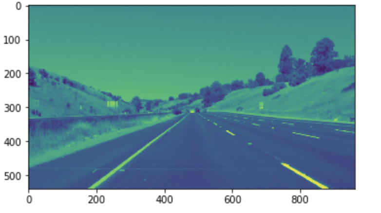
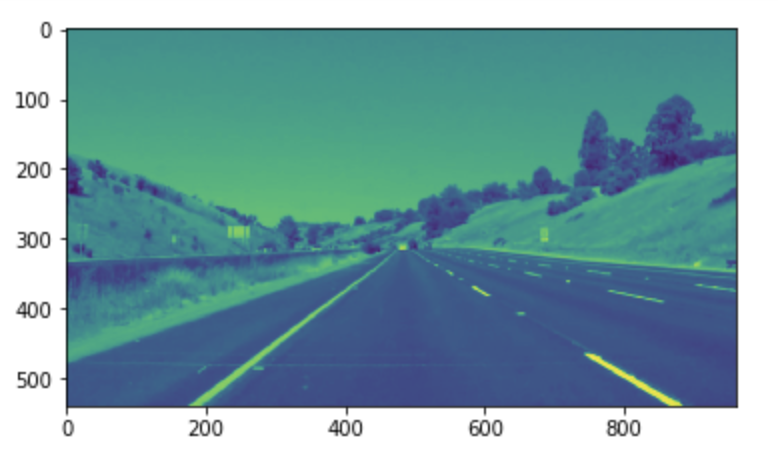
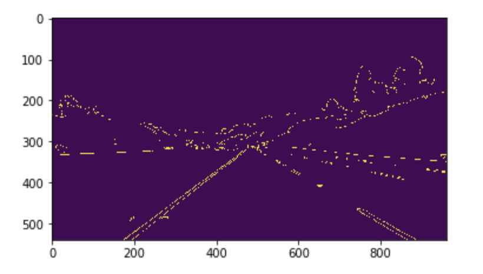
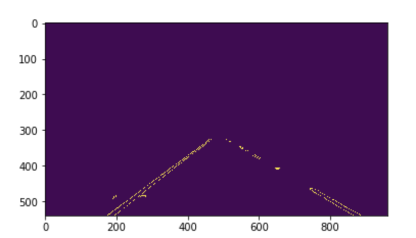
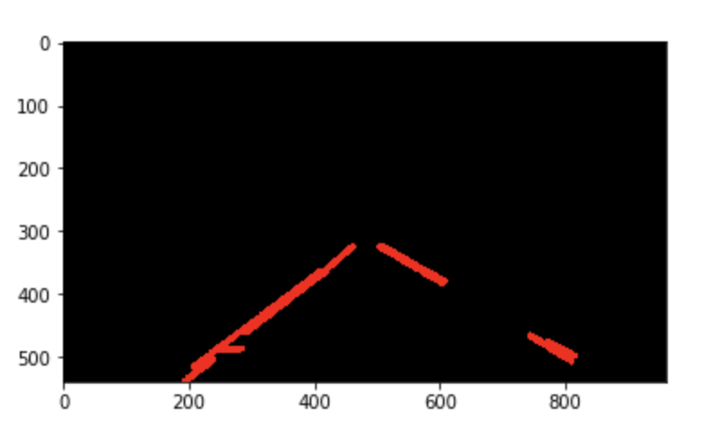
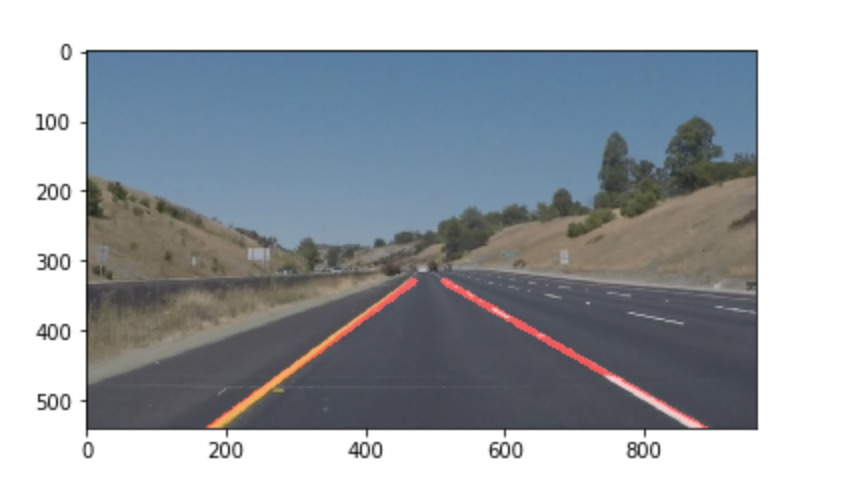
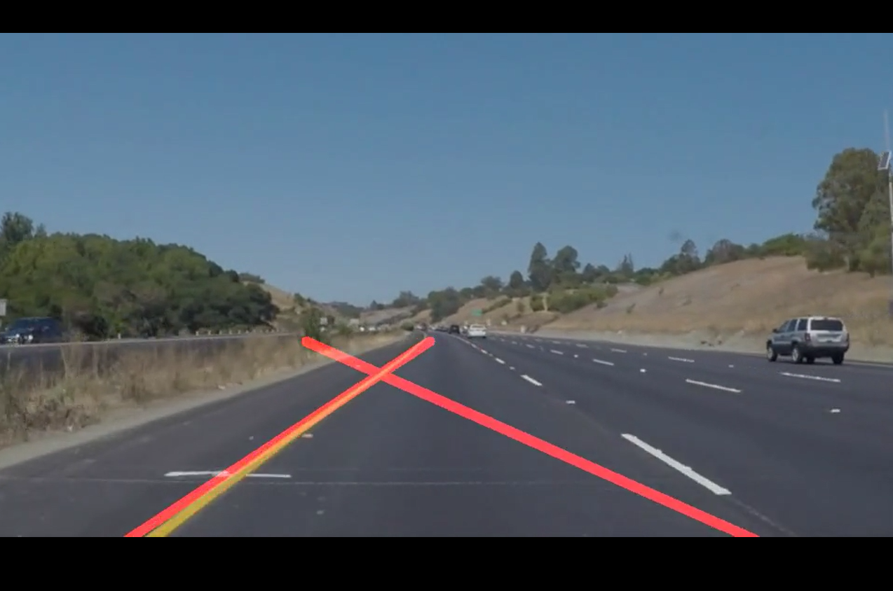
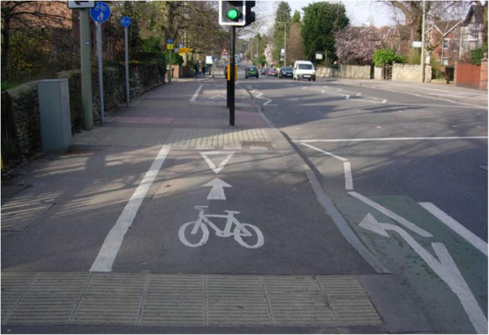

# **Finding Lane Lines on the Road** 

---

**Finding Lane Lines on the Road**

The goals / steps of this project are the following:
* Make a pipeline that finds lane lines on the road
* Summarize my work in this report

[//]: # (Image References)

[image1]: ./examples/grayscale.jpg "Grayscale"

---

### Reflection

### 1. Pipeline Description

My pipeline consisted of 5 steps. First, I converted the images to grayscale, then I apply Gaussian Blur method to smooth the grayscale image. The third step is to find the Canny Edges by specifying the low and high threshold values. To exclude the irrelevant objects, it is necessary to mask the image with a polygon in the fourth step. In this project, I used a four sided polygon by assuming the lanes are always showing in the cropped rectangular region. Finally, I run Hough Transform on the edge detected image. In This step, also plot the detected lanes by extrapolating the line segments using the `numpy.polyfit()` function. 

If you'd like to include images to show how the pipeline works: 

### 2. Main Challenges

In my first submission, sometimes the video shows that the two detected lines intersect each other. As the following picture shows. According to the reviewer's suggestion, I find that the root cause of the intersection is that the slope of one of the extrapolated lines changed dramatically from the last video frame. For example, in the frame 1, the slopes of two lines are 0.7, -0.7. In the next frame, one line's slope suddenly changes from -0.7 to -0.4, at this moment, this line intersects with the other line in the region of interest (ROI). In this project, I simply give a hard bound of each line to make sure the detected line never changes its slope dramatically from frame to frame. 

The bounds I use for the left and right lines are `(0.5, 0.9)` and `(-0.9, -0.5)`, respectively. The results show that such bounds work well with given testing videos.

### 3. Identify Potential Shortcomings 

One potential shortcoming would be this implementation may not do well when the data contains too many outliers. For example, the outlier points could make the detected lanes swing.

Another shortcoming could be this implementation uses many hard-coded parameters, so this application may  not react to other scenarios well, for instance, when the images have low resolutions because of the poor light conditions, foggy weather, etc. 

Moreover, in this project, I apply a hard-coded slope bounds for the detected lines, this method is highly like not a good solution for other lane detecting scenarios. 

Finally, the extrapolating lane plotting method works well here but not necessarily everywhere. A counter example is the road in London, United Kindom, shown in the picture below. We can see that the lanes are sawtooth-like segments. instead of a straight line segment. In such scenario, the extrapolating method may not working well.

### 4. Suggest Possible Improvements 

A possible improvement would be to add more steps to correctly identify and filter out the outliers.

Another potential improvement could be to use dynamic parameters for the ROI, instead of the hard-coded values.
